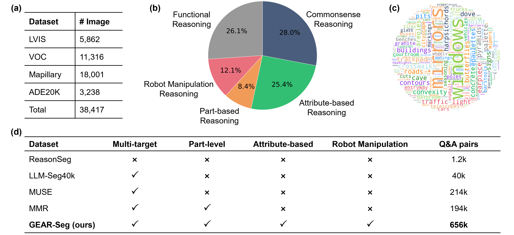

# GEAR-Seg: A Grounded Explainable Agent for Reasoning Segmentation and Data Engine

<font size=4><div align='center'><b>GEAR-Seg</b>: <b>G</b>rounded <b>E</b>xplainable <b>A</b>gent for <b>R</b>easoning <b>S</b>egmentation</div></font>

[[`Paper`]( )] [[`Project`](https://github.com/AgRoboticsResearch/SDM-D.gi)]  [[`Dataset`]( )]


**🍄GEAR-Seg** serves as both a zero-shot inference agent and a scalable data engine, explicitly translating pixels into text to seamlessly support complex reasoning segmentation, dense referring segmentation, and fine-grained attribute grounding in long-tail domains.

## 🍇 Installation

This guide provides a step-by-step process for setting up the environment for GEAR-Seg. The project builds upon **SAM-2** and **DAM**, ensuring that all dependencies are properly configured.

### 1. Clone the Repository
Clone this repository and navigate into the project directory:
```bash
git clone https://github.com/AgRoboticsResearch/GEAR-Seg.git
cd GEAR-Seg
```

### 2. Create and Activate a Conda Environment
We strongly recommend using Conda to manage dependencies. Create a new environment with Python 3.10 and activate it:
```bash
conda create -n gear-seg python=3.10 -y
conda activate gear-seg
```

### 3. Install PyTorch
Install the appropriate version of PyTorch and Torchvision for your system. For a system with CUDA 12.1, use the following command:
```bash
pip3 install torch torchvision --index-url https://download.pytorch.org/whl/cu121
```
Visit the [PyTorch official website](https://pytorch.org/get-started/locally/) to find the correct command for your specific hardware configuration.

### 4. Install Project Dependencies
The core dependencies of this project, including SAM-2 and DAM, are included as submodules or can be installed from their respective repositories.

**Install the Project in Editable Mode**
Install `GEAR-Seg` and its dependencies in editable mode. This allows you to modify the source code and have the changes immediately reflected:
```bash
pip install -e .
```

### 5. Install Ollama
GEAR-Seg utilizes a vision-language model to generate whole-image descriptions for reasoning segmentation. Deploy **Llama 3.2 Vision** locally using **Ollama**:

Follow the official instructions from the Ollama website:  
https://ollama.com

For most Linux and macOS systems, Ollama can be installed with:
```bash
curl -fsSL https://ollama.com/install.sh | sh
ollama serve
ollama pull llama3.2-vision
```

### 6. Download Checkpoints
Download the model weight files to the `./checkpoint` folder. The required checkpoints are:
- [sam2_hiera_large.pt](https://dl.fbaipublicfiles.com/segment_anything_2/072824/sam2_hiera_large.pt)
- [DAM-3B](https://huggingface.co/nvidia/DAM-3B)

### 7. Apply an API Key
We recommend using **DeepSeek-R1-0528** for reasoning. Apply for an API key from [DeepSeek](https://platform.deepseek.com/api_keys).

### 8. Organize Dataset
Place your dataset into the `./Images` folder. Below is an example structure:
```bash
dataset/
├── your_dataset_name/
│   ├── images_dir/
│   │   ├── 001.png
│   │   ├── 002.png
│   │   └── ...
│   ├── questions_dir/
│   │   ├── 001.json
│   │   ├── 002.json
│   │   └── ...
```
## 🚀 Quick Start
To quickly experience the GEAR-Seg agent, we provide an interactive Jupyter Notebook demo in [reasoning_segmentation.ipynb](./run_demo/reasoning_segmentation.ipynb).


## 🧠 Reasoning Segmentation

Run the [GEAR-Seg-Reason.py](./GEAR-Seg-Reason.py) script as follows:
```bash
cd GEAR-Seg

python GEAR-Seg-Reason.py \
      --image_folder /path/to/images_dir \
      --question_dir /path/to/questions_dir \
      --api_key "your_api_key"
```

The results will be saved to `./outputs/reasonseg_task`. Users can review segmentation details and descriptions in the following structure:
```bash
outputs/reasonseg_task
├── split_name/
│   ├── answer/
│   │   ├── json/      # Answers to the questions
│   │      ├──001.json
│   │      ├──002.json
│   │   ├── visual/    # Visualizations of reasoning results
│   │      ├──001.png
│   │      ├──002.png
│   ├── dam/
│   │   ├── descriptions/  # Dense descriptions of mask regions
│   │      ├──001.json
│   │      ├──002.json
│   ├── sam/
│   │   ├── masks/  # Image masks
│   │      ├──001
│   │      ├──002
│   │   ├── anns_visual/  # Visualizations of masks with indices
│   │      ├──001.png
│   │      ├──002.png
```


## 🚀 Scalable Data Engine

Beyond zero-shot inference, GEAR-Seg functions as a highly scalable data engine. It can generate high-quality datasets, and the workflow as:


Run the following script and run [GEAR-Seg-Dataset.py](./GEAR-Seg-Dataset.py) to generate datasets. 
```bash
cd GEAR-Seg

python GEAR-Seg-Dataset.py \
      --image_folder /path/to/images_dir \
      --api_key "your_api_key"
```

Additionally, GEAR-Seg supports referring segmentation tasks and long-tail tasks such as maturity degree grading. You can also modify the prompts in [reasonseg_dataset.py](./utils/reasonseg_dataset.py) to customize your task. Once datasets are generated, smaller models can be distilled as needed.

## 📂 Dataset

We also introduce **GEAR-131K**, a comprehensive benchmark comprising over 38k images and 656k diverse QA-mask pairs. Five distinct reasoning categories are defined within GEAR-131K. Details are as follows. You can download the dataset here:


## 💘 Acknowledgements

- [SAM 2](https://github.com/facebookresearch/sam2.git)
- [DAM](https://github.com/NVlabs/describe-anything)


